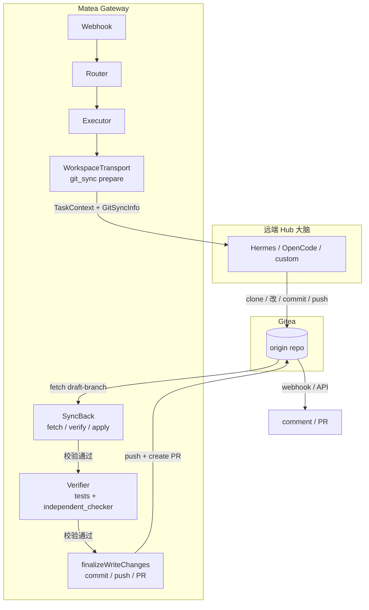
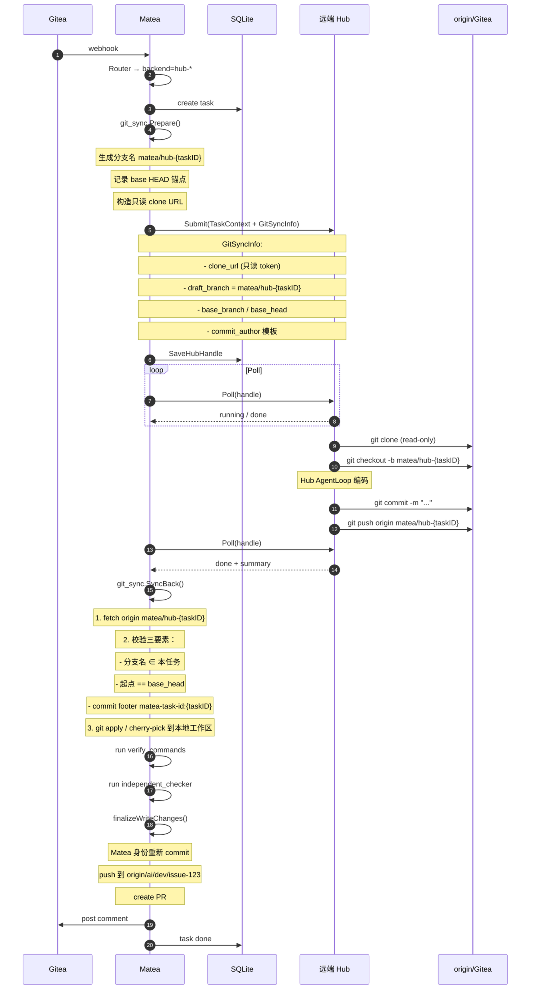

# Hub 远端大脑接入改造计划 — 仅保留 git_sync

> 日期：2026-08-14  
> 范围：在保留 `builtin` 的基础上，改造远端 `hub-*` 大脑接入，**只保留 `git_sync` 一条路线**，废弃 `shared_path` 和 `mcp` transport。  
> 基调：项目处于早期，无真实用户，允许大刀阔斧重构。

---

## 一、目标与约束

### 目标
- 让远端 Hub（Hermes / OpenCode / 未来任意 Hub）可以部署在独立主机、容器或跨网络环境。
- Matea 继续拥有 Gitea 写回权、工作流闸门、审计、会话管理。
- 新 Hub 类型接入成本低：只需实现 `HubBackend` + 声明支持 `git_sync`。

### 硬约束
1. **保留 `builtin`**：本地 LLM + 本地 sandbox 路径不变。
2. **只保留 `git_sync`**：`shared_path` 和 `mcp`  transport 直接删除，不再维护。
3. **写回权永远在 Matea**：Hub 只是「提案者」，最终 commit / push / PR 必须由 Matea 执行。
4. **不信任 Hub 的承诺，只信可验证的事实**：Hub 推的分支只是「草稿送达」，Matea 必须校验后才合并到 repo。

---

## 二、核心设计原则

### 原则 1：Git 是唯一事实来源
Matea 与远端 Hub 之间不共享文件系统、不共享进程、不直接交换 diff。唯一交互界面是 Git 仓库上的一个分支。

### 原则 2：Hub 是「提案者」，Matea 是「审批者」
- Hub 可以 clone、改代码、commit、push 到 `origin/<draft-branch>`。
- Matea 必须 fetch 该分支、校验 commit 来源、重新应用变更、由 Matea 身份提交、开 PR。
- 即使 Hub 被攻破，只要 Matea 的校验/门禁生效，就无法污染主分支。

### 原则 3：最小权限
- Hub 默认只需要**只读 clone** 凭据。
- 若 Hub 必须 push，则使用**任务级一次性分支** + 限定前缀的写权限，任务结束即失效。
- 绝不暴露 Matea admin token 给 Hub。

---

## 三、新的架构



---

## 四、git_sync 详细数据流



---

## 五、关键数据结构

### 5.1 GitSyncInfo

```go
type GitSyncInfo struct {
    // 只读 clone URL，包含短期 read-only token
    CloneURL string `json:"clone_url"`

    // Hub 只能 push 到这个分支
    DraftBranch string `json:"draft_branch"`

    // 目标 base 分支
    BaseBranch string `json:"base_branch"`

    // Matea 记录的 fork 点，用于校验 Hub 没有从奇怪的地方开始改
    BaseHEAD string `json:"base_head"`

    // 要求 Hub 提交时使用的 author 信息
    CommitAuthorName  string `json:"commit_author_name"`
    CommitAuthorEmail string `json:"commit_author_email"`

    // Hub 提交信息中必须包含的 footer
    RequiredFooter string `json:"required_footer"`

    // 是否允许 Hub push（false 时 Hub 只能回传 patch，Matea 自己推）
    AllowHubPush bool `json:"allow_hub_push"`
}
```

### 5.2 BackendResult 扩展

```go
type BackendResult struct {
    Summary      string        `json:"summary"`
    GiteaActions []GiteaAction `json:"gitea_actions,omitempty"`
    Deliver      *DeliverRequest `json:"deliver,omitempty"`

    // Hub 自报已完成 git/PR（默认忽略，仅在 HandlesGit=true 时考虑，本方案中不推荐）
    ExternallyHandled bool `json:"externally_handled,omitempty"`

    // === 新增：git_sync 专用 ===
    GitSync *GitSyncResult `json:"git_sync,omitempty"`
}

type GitSyncResult struct {
    // Hub 报告的远端分支
    DraftBranch string `json:"draft_branch"`

    // Hub 报告的最终 HEAD
    DraftHEAD string `json:"draft_head"`

    // 如果 Hub 不能 push，可以回传 patch base64
    PatchBase64 string `json:"patch_base64,omitempty"`
}
```

### 5.3 HubHandle 扩展

在现有 `hub_handles` 表基础上扩展：

```go
type HubHandle struct {
    TaskID         int64  `json:"task_id"`
    Backend        string `json:"backend"`
    RemoteID       string `json:"remote_id"`
    IdempotencyKey string `json:"idempotency_key"`
    Status         string `json:"status"`

    // === 新增 ===
    DraftBranch string `json:"draft_branch"`
    BaseHEAD    string `json:"base_head"`
}
```

---

## 六、关键改造点

### 6.1 删除 shared_path 和 mcp transport

- `internal/config/schema.go`
  - 删除 `WorkspaceTransportSharedPath`、`WorkspaceTransportMCP` 常量。
  - `workspace_transport` 字段保留但固定为 `git_sync`，或直接移除该配置项（因为只有一种）。
- `internal/agents/opencode_http.go`
  - 删除 `X-Opencode-Directory` 本地路径传递逻辑。
  - OpenCode backend 改为通过 `git_sync` 交互：把 `GitSyncInfo` 传给 OpenCode session。
- `internal/mcp/client.go` 及 `tools_mcp.go`
  - 如果存在且仅用于 transport，直接删除。
  - 如果 MCP 还有非 transport 用途，保留但禁用 workspace transport 相关能力。

### 6.2 抽象 WorkspaceTransport 接口

新增 `internal/agents/workspace_transport.go`：

```go
package agents

import "context"

type WorkspaceTransport interface {
    Name() string
    Prepare(ctx context.Context, task *store.Task, agent *store.Agent, factory *RunnerFactory) (*TransportHandle, error)
    SyncBack(ctx context.Context, handle *TransportHandle, task *store.Task) error
    Cleanup(handle *TransportHandle) error
}

type TransportHandle struct {
    WorkDir     string
    DraftBranch string
    BaseBranch  string
    BaseHEAD    string
}
```

只有一种实现：`gitSyncTransport`。

### 6.3 改造 runner_write.go

当前流程：

```
prepareWriteWorkspace → CodingBackend.Run → finalizeWriteChanges
```

新流程（hub-* 写任务）：

```
git_sync.Prepare → backend.Submit/Poll → git_sync.SyncBack → verify → finalizeWriteChanges
```

`builtin` 路径保持不变。

具体改动：
- `runWriteTask` 中，如果是 `hub-*` backend，走 `runViaHub` 分支。
- `runViaHub` 返回后，如果是写任务，继续进入 `SyncBack` + `finalizeWriteChanges`。
- 删除 `CodingBackend.Run` 中 OpenCode 的本地共享路径调用。

### 6.4 改造 hub_run.go

- `runViaHub` 需要区分读任务和写任务。
- 读任务（analyze/review/reply）：直接 `mapHubResult` → 发评论。
- 写任务（solve/fix）：返回 `BackendResult` 后，由调用方继续 `SyncBack` + `finalizeWriteChanges`。

### 6.5 新增 git_sync 校验器

新增 `internal/agents/git_sync_verify.go`：

```go
func VerifyHubDraft(git *sandbox.Git, handle *HubHandle) error {
    // 1. 分支名必须是 matea/hub-{taskID}
    // 2. 分支起点必须是 handle.BaseHEAD
    // 3. commit message footer 必须包含 matea-task-id:{taskID}
    // 4. 检查文件路径白名单（可选）
}
```

### 6.6 改造 config schema

- 新增 `hub_git_sync` 配置段：

```yaml
hub_git_sync:
  enabled: true
  branch_prefix: "matea/hub-"
  commit_author_name: "matea-hub"
  commit_author_email: "hub@matea.local"
  credentials:
    type: "read_only_token"  # 或 deploy_key
    token: "${HUB_GIT_READONLY_TOKEN}"
    lifetime: "1h"
  allow_hub_push: true
  required_footer: "matea-task-id"
```

### 6.7 改造 Hermes backend

`internal/agents/backends/hermes/hermes.go`：
- `buildRunRequest` 中把 `GitSyncInfo` 注入到 input / instructions。
- Hermes 侧需要能解析 `GitSyncInfo` 并执行 clone/push（如果 Hermes 是本团队维护，同步改造；如果是第三方，通过文档约定）。

### 6.8 改造 OpenCode backend

`internal/agents/opencode_http.go`：
- 不再传本地 `WorkDir`。
- 在 `createSession` / `sendMessage` 时把 `GitSyncInfo` 作为请求体的一部分传给 OpenCode。
- OpenCode 侧需要支持读取 `GitSyncInfo` 并自行 clone/push。

---

## 七、安全与权限设计

### 7.1 权限分级

| 方案 | Hub 权限 | 适用场景 |
|---|---|---|
| A（推荐） | 只读 clone | Hub 回传 patch 或 Matea 代为 push |
| B | 限定分支前缀写 | Hub 需要直接 push draft branch |

### 7.2 凭据管理

- 凭据走环境变量注入，如 `${HUB_GIT_READONLY_TOKEN}`。
- `config.yaml` 中只保留类型和生命周期配置，不保存明文 token。
- 任务级 token 由 Matea 在 `Prepare` 时生成，任务结束或超时后撤销。

### 7.3 校验三要素

1. **分支独占**：分支名 `matea/hub-{taskID}` 全局唯一，`hub_handles` 表登记所有权。
2. **起点锚定**：Matea 记录 `base_head`，fetch 后校验 draft branch 的起点是否一致。
3. **身份签名**：Hub 提交必须带 `footer: matea-task-id: {taskID}`，Matea 校验 author / footer。

任一不满足，任务失败并告警。

### 7.4 diff 白名单（可选增强）

- 对于高敏感仓库，Matea 可以配置 `allowed_paths` / `denied_paths`。
- `SyncBack` 后校验 diff 范围，越界则拒绝。

---

## 八、Session 处理

### 8.1 当前问题

现有 `agent_sessions` / `WorkflowContext` 以本地工作区路径为核心（`session.WorkspacePath`），远端模式下无法复用。

### 8.2 解耦方案

把 Session 从「工作区路径」解耦为「git 分支 + 记忆」：

```go
type Session struct {
    ID            string
    Branch        string   // 当前 session 分支
    BaseBranch    string   // 基础分支
    LastHead      string   // 上次任务完成后的 HEAD
    WorkspacePath string   // 仅 builtin/shared_path 使用；git_sync 可为空
    Memory        map[string]string
}
```

远端模式下：
- 每个新任务基于 `session.LastHead` 继续。
- Hub 完成 push 后，Matea `SyncBack` 更新 `session.LastHead`。
- 记忆通过 `memories` 表（repo/issue 级 key/value）共享，已存在 `loadMemoryKeys` / `saveAnalyzeMemory`。

---

## 九、实施步骤

### Phase 1：清理与抽象（1 周）

1. 删除 `shared_path` / `mcp` transport 相关代码和配置。
2. 新增 `WorkspaceTransport` 接口，`gitSyncTransport` 作为唯一实现。
3. 改造 `internal/config/schema.go`，固定 `workspace_transport=git_sync` 或移除该字段。
4. 所有测试调整：删除共享路径/MCP 相关用例。

### Phase 2：git_sync 核心链路（1-2 周）

1. 扩展 `TaskContext` / `BackendResult` / `HubHandle` 加 `GitSyncInfo` / `GitSyncResult`。
2. 实现 `gitSyncTransport.Prepare()`：
   - 生成分支名 `matea/hub-{taskID}`。
   - 记录 `base_head`。
   - 构造只读 clone URL。
3. 实现 `gitSyncTransport.SyncBack()`：
   - fetch draft branch。
   - 校验三要素。
   - apply 变更到本地工作区。
4. 改造 `runner_write.go`：hub-* 写任务走 `runViaHub → SyncBack → finalizeWriteChanges`。
5. 改造 `hub_run.go`：区分读/写任务返回值。

### Phase 3：后端适配（1 周）

1. 改造 Hermes backend：把 `GitSyncInfo` 注入 run request。
2. 改造 OpenCode backend：不再传本地路径，改为传 `GitSyncInfo`。
3. 提供 fake remote hub 集成测试。

### Phase 4：安全与 Session（1 周）

1. 实现凭据模板（read-only token / deploy key）。
2. 实现校验三要素 `VerifyHubDraft`。
3. 解耦 Session：分支 + 记忆替代工作区路径。
4. diff 白名单（可选）。

### Phase 5：测试与文档（1 周）

1. 单元测试：分支生成、校验三要素、SyncBack。
2. 集成测试：fake hub 推正常分支 / 越权分支 / 无签名提交 / 假完成。
3. E2E 测试：完整 solve_issue 链路。
4. 文档：`docs/HUB-BACKENDS.md` 描述信任模型、权限模板、接入契约。

---

## 十、测试计划

### 10.1 单元测试

- `internal/agents/git_sync_transport_test.go`
  - 分支名生成规则。
  - `Prepare` 输出 `GitSyncInfo` 正确性。
- `internal/agents/git_sync_verify_test.go`
  - 正常提交通过校验。
  - 越权分支拒绝。
  - 起点不一致拒绝。
  - 缺少 footer 拒绝。
- `internal/agents/runner_write_test.go`
  - hub-* 写任务走新链路。
  - builtin 路径不变。

### 10.2 集成测试

- `internal/agents/backends/fakehub/` 新增 fake remote hub：
  - 接收 `Submit`，按 `GitSyncInfo` clone/push。
  - 支持对抗用例：推错分支、改错起点、缺 footer、没改代码。
- 验证所有对抗用例都被 Matea 拒绝并标记失败。

### 10.3 E2E 测试

- 真实 Gitea + 远端 Hub（本地起 sidecar 或 Hermes mock）。
- 跑通 solve_issue → PR 创建 → comment 回写。

---

## 十一、风险与缓解

| 风险 | 缓解 |
|---|---|
| Hub 不遵循 git_sync 契约 | 校验三要素，失败即 fail |
| Hub 只读 token 泄露 | 短期 token / deploy key，任务结束撤销 |
| Hub push 分支被覆盖 | 分支名 taskID 唯一 + base_head 锚定 |
| Hub 产生幻觉（没改代码） | `git.HasChanges()` + `verify_commands` + `independent_checker` |
| Session 工作区无法复用 | 解耦为 git 分支 + 记忆 |
| OpenCode 不支持 git_sync | 同步改造 OpenCode 侧或移除 OpenCode backend |

---

## 十二、一句话总结

> **只保留 `git_sync`：远端 Hub 自管沙箱、改代码、推 draft 分支；Matea fetch 后校验分支独占/起点锚定/身份签名，重新提交并开 PR。builtin 路径不变，shared_path 和 mcp 直接删除。**
