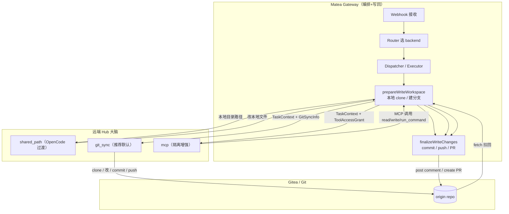
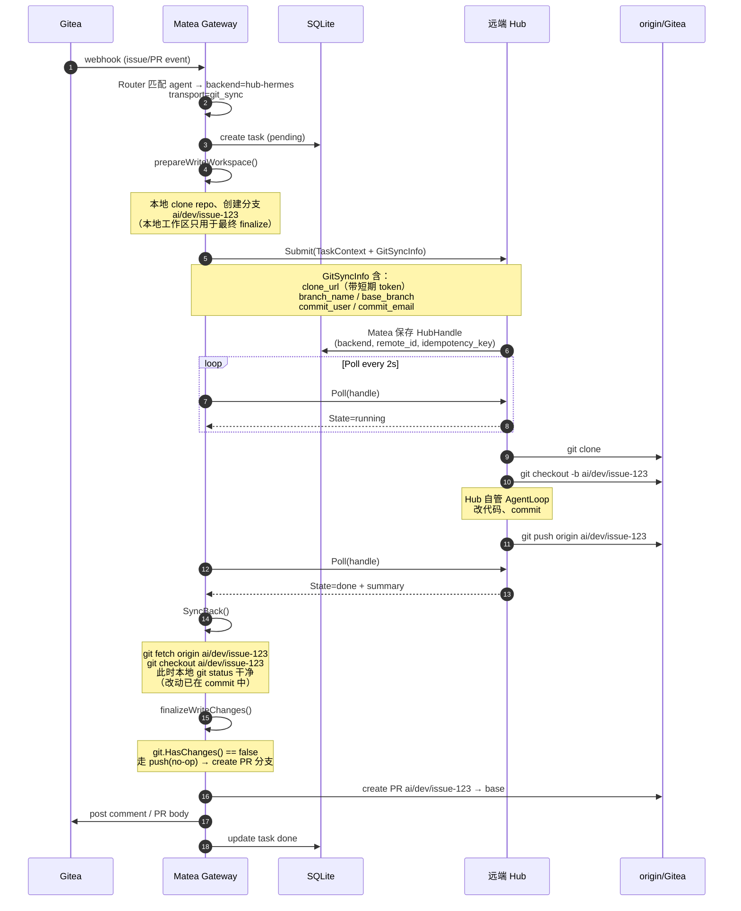
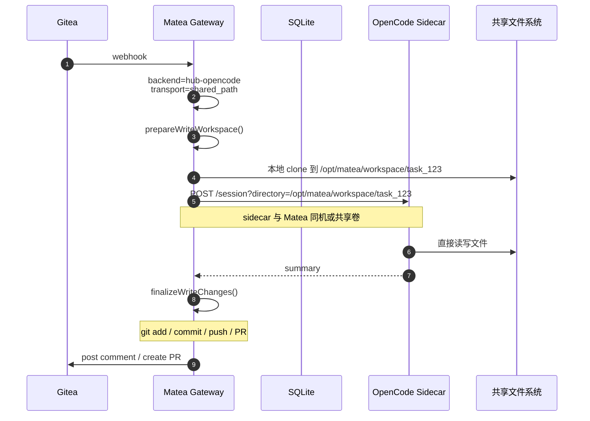
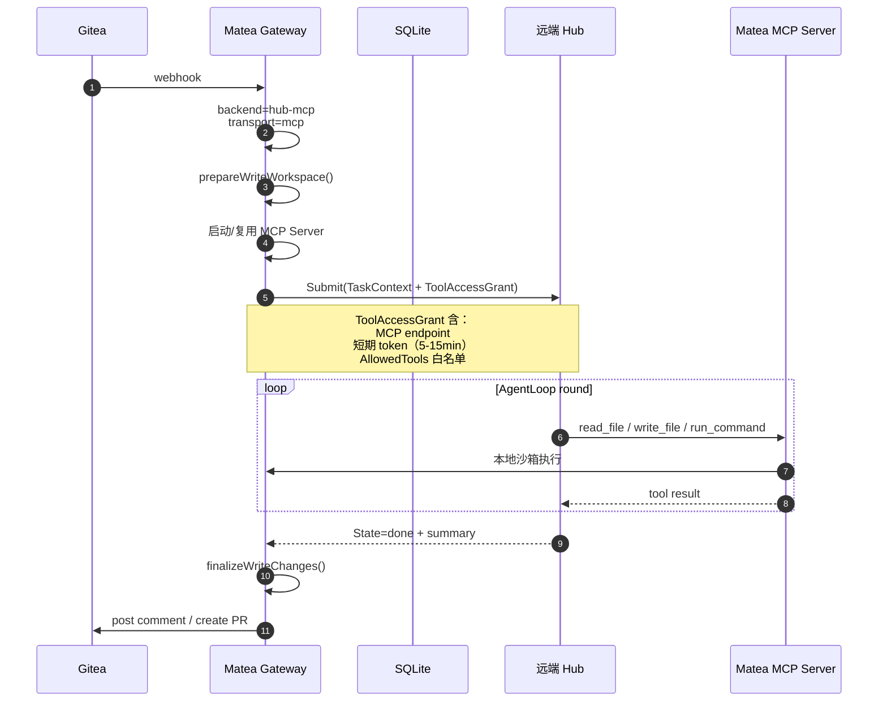
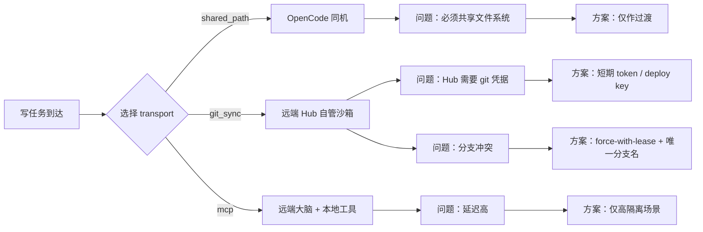

# 远端 Hub 大脑部署方案 — 数据流与场景说明

> 说明：本文档描述 Matea 支持「远端 / 非同机部署 Hub 大脑」的三种 transport 模式、数据流转，以及各场景需要注意的问题和解决方案。

---

## 一、三种 Transport 总览

### 三种模式取舍

| Transport | 数据怎么到 Hub | 代码是否离开 Matea | 对 Hub 的部署要求 | 适用场景 |
|---|---|---|---|---|
| `shared_path` | 传本地绝对路径 | 否（同一文件系统） | 必须与 Matea 同机/共享卷 | OpenCode 同机过渡 |
| `git_sync` ⭐ | TaskContext 传 clone URL + branch | 是（Hub 自管沙箱） | 能访问 Gitea 即可 | **推荐默认** |
| `mcp` | TaskContext 传 MCP endpoint + token | 否（文件级 RPC） | 必须是 MCP client | 高隔离/跨组织 |

---

## 二、git_sync 详细数据流（推荐默认）

### git_sync 关键边界说明

| 步骤 | 谁负责 | 注意问题 | 解决方案 |
|---|---|---|---|
| 1. 本地 clone / 建分支 | Matea | 远端 Hub 也需要知道分支名 | `TaskContext.GitSyncInfo.BranchName` |
| 2. 给 Hub 传 git 凭据 | Matea | Hub 拿到 token 有泄露风险 | 短期 token / deploy key / SSH key 任务结束后撤销 |
| 3. Hub clone & push | Hub | Hub 必须能访问 Gitea | 网络白名单 / VPN / TLS |
| 4. Matea fetch 拉回 | Matea | 分支可能被覆盖/冲突 | Hub 用 force-with-lease Matea 校验 remote head |
| 5. finalize 创建 PR | Matea | Hub 没 push 或 push 失败 | Poll 阶段必须确认 done 前 push 成功 |
| 6. 任务重试 | Matea | 重复 Submit 会创建多个远程 run | `IdempotencyKey` + `HubHandle` 持久化 |

---

## 三、shared_path 数据流（OpenCode 同机过渡）

### shared_path 注意事项

| 问题 | 解决方案 |
|---|---|
| 远端 sidecar 无法访问 Matea 本地路径 | 必须同机或 NFS/分布式卷 或迁移到 git_sync |
| 任务中断后 sidecar 改了文件但没 push | 非 session 任务直接失败（当前代码已如此处理） session 任务复用同一目录可恢复 |
| 多个 sidecar 实例共享状态 | 按 task_id 隔离目录 |

---

## 四、mcp 数据流（隔离增强）

### MCP 注意事项

| 问题 | 解决方案 |
|---|---|
| 每个 tool call 跨网，延迟高 | 仅用于高隔离场景，不作为默认 |
| MCP session 需要稳定双向连接 | HTTP SSE / WebSocket / Streamable HTTP |
| Hub 必须是 MCP client | 新 Hub 接入需要写 MCP adapter |
| 工具调用可能被滥用 | `AllowedTools` 白名单 + 短期 token + 审计 |

---

## 五、三种写任务场景对比

---

## 六、核心状态机

```mermaid
stateDiagram-v2
    [*] --> Pending: webhook → task enqueue
    Pending --> Preparing: Executor 取出任务
    Preparing --> Submitted: prepareWriteWorkspace 完成
    Submitted --> Running: Hub Submit 成功
    Running --> Running: Poll 等待
    Running --> SyncBack: Hub done
    SyncBack --> Finalizing: git fetch / checkout
    Finalizing --> Done: PR created / comment posted
    Finalizing --> Failed: push / PR 失败
    Running --> Failed: Hub 失败
    Running --> Canceled: 任务取消

    Submitted --> Submitted: Matea 重启后<br/>从 HubHandle 恢复
```

---

## 七、核心改造文件索引

| 文件 | 改造内容 |
|---|---|
| `internal/agents/workspace_transport.go`（新增） | `WorkspaceTransport` 接口及三种实现 |
| `internal/agents/hub_backend.go` | `TaskContext` 增加 `GitSyncInfo`、`ToolAccessGrant` 扩展 |
| `internal/agents/runner_write.go` | 写任务按 transport 分发，git_sync 路径加 `SyncBack` |
| `internal/agents/hub_run.go` | `runViaHub` 支持写任务分支进入 finalize |
| `internal/agents/write_workspace.go` | `prepareWriteWorkspace` 按 transport 分发 |
| `internal/agents/backends/hermes/hermes.go` | Hermes 接收 `GitSyncInfo`，自管 clone/push |
| `internal/agents/opencode_http.go` | 保留 shared_path，新增 git_sync 选项 |
| `internal/config/schema.go` | `workspace_transport` 允许 `git_sync`、`mcp` |

---

## 八、一句话总结

> **Git 是 Matea 与远端 Hub 之间的唯一事实来源**。推荐默认走 `git_sync`：Matea 负责 clone/建分支/最终 PR，远端 Hub 负责编码并 push 回 origin；`shared_path` 留给 OpenCode 同机过渡；`mcp` 留给不允许 Hub 碰 Git 的高隔离场景。
